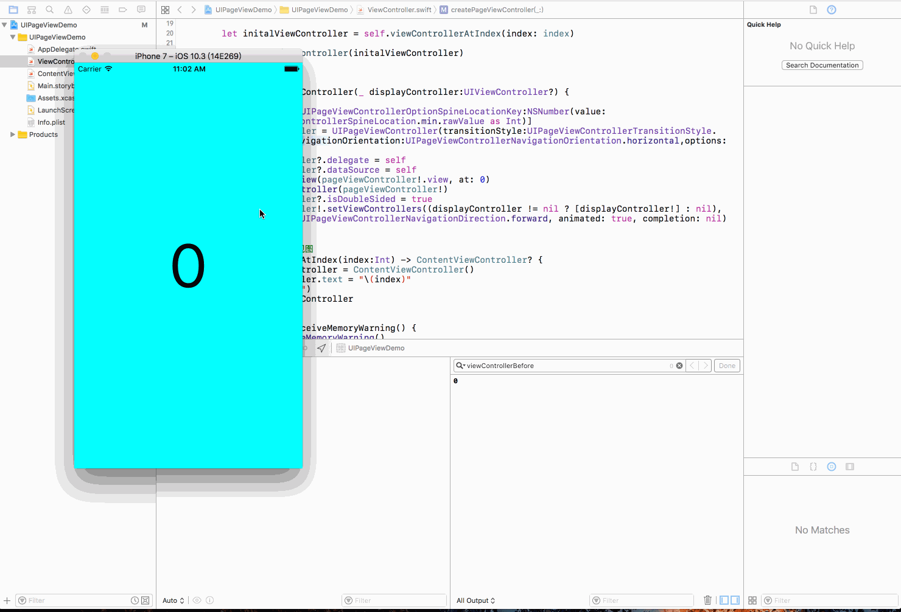
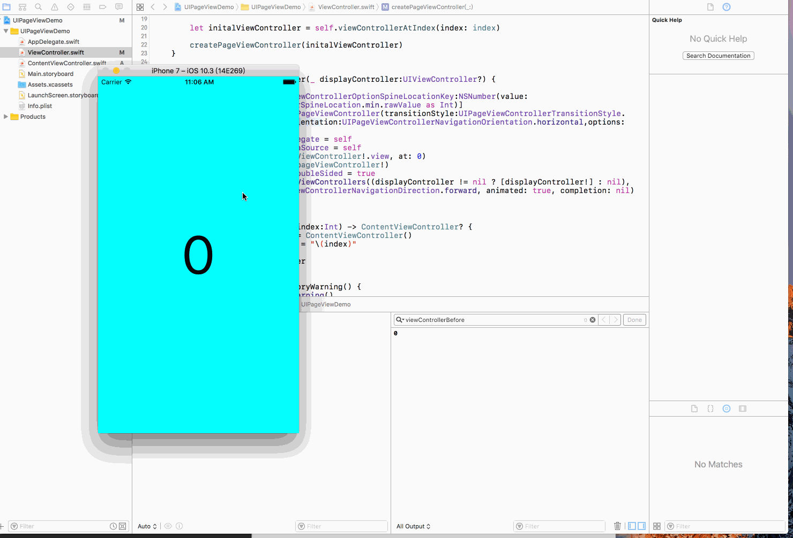

#UIPageViewController

#初始化
 
```
let options = [UIPageViewControllerOptionSpineLocationKey:NSNumber(value: UIPageViewControllerSpineLocation.min.rawValue as Int)]
pageViewController = UIPageViewController(transitionStyle:UIPageViewControllerTransitionStyle.pageCurl,navigationOrientation:UIPageViewControllerNavigationOrientation.horizontal,options: options)
// 注意UIPageController必须放在Controller Container中
addChildViewController(pageViewController!)
view.insertSubview(pageViewController!.view, at: 0)
// 初始化内容控制器
let initalViewController = self.viewControllerAtIndex(index: index)
pageViewController!.setViewControllers((displayController != nil ? [displayController!] : nil), direction: UIPageViewControllerNavigationDirection.forward, animated: true, completion: nil)
```

transitionStyle - 翻页风格

* pageCurl - 卷起来翻卷，类似于书本翻页效果
* scroll - 水平滚动翻页，类似于ScrollView的滑动效果

navigationOrientation - 翻页方向

* horizontal
* vertical

options

* 这是一个字典，设置翻页控制器的书脊位置（none／min／mid／max）

isDoubleSided

* 开启单双页 如果为了页面背景颜色，可开启

#代理

* UIPageViewControllerDelegate

```
准备翻页
optional public func pageViewController(_ pageViewController: UIPageViewController, willTransitionTo pendingViewControllers: [UIViewController])

翻页结果
optional public func pageViewController(_ pageViewController: UIPageViewController, didFinishAnimating finished: Bool, previousViewControllers: [UIViewController], transitionCompleted completed: Bool)

```

* UIPageViewControllerDataSource

```
向前翻页
public func pageViewController(_ pageViewController: UIPageViewController, viewControllerBefore viewController: UIViewController) -> UIViewController?

向后翻页
public func pageViewController(_ pageViewController: UIPageViewController, viewControllerAfter viewController: UIViewController) -> UIViewController?

翻页总数
optional public func presentationCount(for pageViewController: UIPageViewController) -> Int
```

# 一些注意事项
* transitionStyle为pageCurl,isDoubleSided为true时，前后翻页会调用两次向前后翻代理
* transitionStyle为scroll时， 前后翻页只调用一次向前后翻代理

# 问题

* 当transitionStyle为pageCurl时，如果向后翻页的时候会有几率调用向前翻页的协议方法



* 当transitionStyle为scroll时，如果向后翻页的时候第一次会调用向前翻页的协议方法



* 偶尔会卡顿


