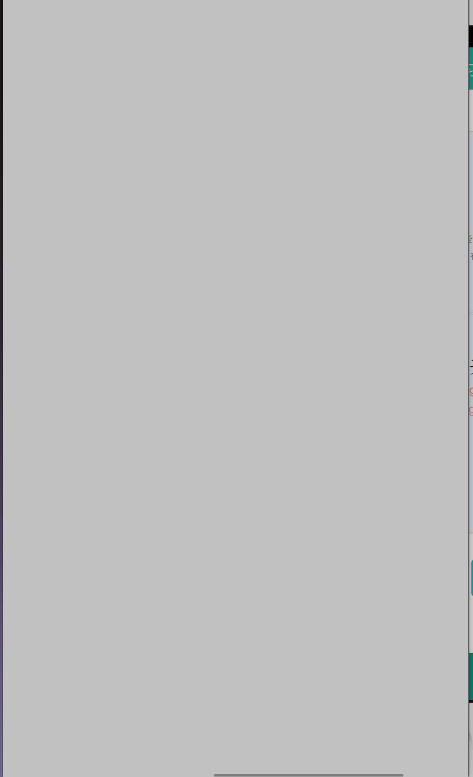
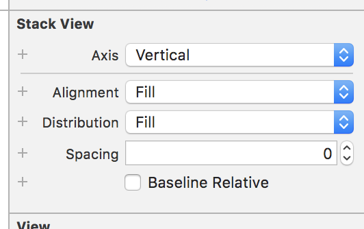

#scrollView添加约束
**scrollView添加约束**

1. 添加scrollView 距上距下距左距右为0
2. 添加view到scrollView上 距上距下距左距右为0 设置高度和horizontally scrollView可以垂直滑动 或者 设置宽度和vertically可以水平滑动

**UIStackView**

- UIStackView的核心是方便垂直或者水平排布多个subview
- UIStackView是不会被渲染的UIView的子类,所以它的backgroundColor或者drawRect方法不会产生任何效果

1. Axis表示Stack View的subview是水平排布还是垂直排布
2. Alignment控制subview对齐方式 (控制X 和 Y值)
 * Fill: 默认
 * Traling: 所有subview靠左
 * Center: 居中
 * Leading: 靠右
3. Distribution定义subview的分布方式 (控制高度和宽度)
 * Fill：默认分布方式
 * Fill Equally：子视图的高度或宽度保持一致
 * Fill Proportionally：stackView自己计算出它认为合适的分布方式
 * Equal Spacing：子视图保持同等间隔的分布方式
 * Equal Cenerting：每个子视图中心线之间保持一致的分布方式
4. Spacing 为subview间的最小间距
5. Baseline Relative 根据subview的基线调整垂直间距

- 添加 
	addArrangedSubview 
	
  去除 
	removeArrangedSubview (只是告诉Stack View不再需要管理subview的约束。而subview会一直保持在视图层级结构中直到调用removeFromSuperview把它移除)